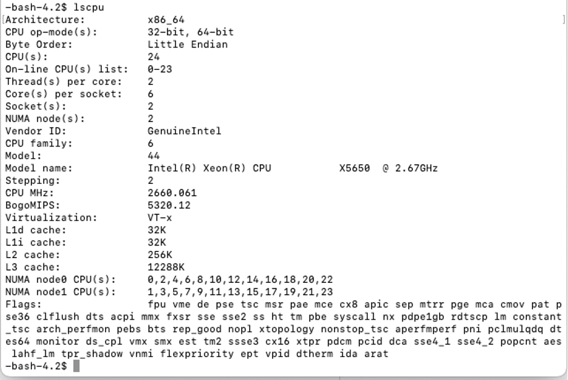
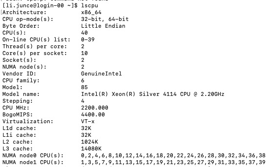
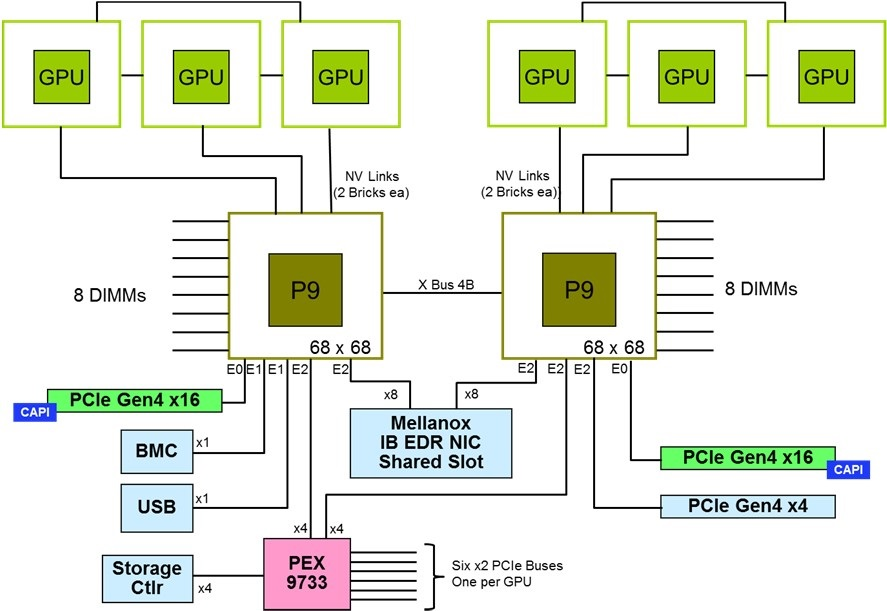
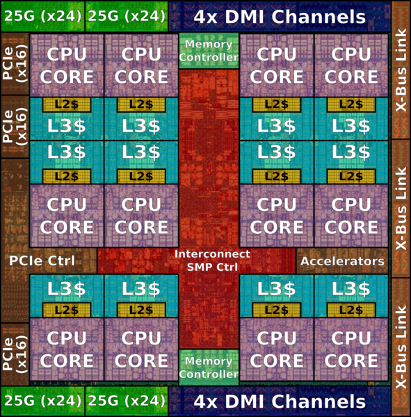

<center> <font size =5>EECE5640 Homework 1 </font></center>

## Question 1:

---
### Subquestion A

Using lscpu to get CPU information of the system.

System: COE Cluster



Through integer and floating-point operations, I'll assess the CPU's performance. The peak bandwidth of both sequential and random memory accesses is something I also strive to monitor.

[Source](https://github.com/arihant15/Performance-Evaluation-Benchmark) 


### CPU Benchmark
- Benchmark 1: 

  Performance-Evaluation-Benchmark (FLOPs): Use 1 thread to execute 200,000 loops of floating-point operations. In order to analyze performance, floating-point operations per second are used.

  Run 10 times:   
  No compiler optimizations
  ```
  gcc -pthread -o CPUBenchmark CPUBenchmark.c
  ```


  1. 10.496456
  2. 10.725012
  3. 10.299949
  4. 10.754614
  5. 9.741086
  6. 10.845330
  7. 10.738967
  8. 10.250397
  9. 10.347875
  10. 10.382472
  
  Avg: 10.4582158

- Benchmark 2

  Performance-Evaluation-Benchmark (IOPs): Run 1 thread through 200,000 loops of integer operations. The performance, which is expressed in integer operations per second, should then be evaluated.

  Run 10 times:   
  No compiler optimizations
  ```
  gcc -pthread -o CPUBenchmark CPUBenchmark.c
  ```
  1. 9.993062
  2. 10.299248
  3. 10.063550
  4. 10.287488
  5. 10.209503
  6. 10.424664
  7. 10.498156
  8. 10.235944
  9. 10.074186
  10. 10.312552
   
  Avg: 10.2398353


### Memory Benchmark
- Benchmark 3
 
    Memory Benchmark: Bandwidth is assessed by experimenting with various prefetching techniques while running various assembly programs for the aligned memory blocks. I'll assess how well read and write operations in seq and rand performed overall. Obtain the latency as well.

  Enter the number of threads I create: 1

  Enter the size: 1024 bytes

  Run 10 times:  
   No compiler optimizations
  ```
  gcc -pthread -o MemBenchmark MemBenchmark.c
  ```

Write:
| Run  | Troughout In Rand | Troughout In Seq |
| :---:|   :----:          |     :---:        |
| 1    | 6676.701687       | 8549.335508      |
| 2    | 7042.149093       | 9074.651663      |
| 3    | 6659.839600       | 8727.224307      |
| 4    | 7039.324601       | 8427.824206      |
| 5    | 6658.449340       | 8727.524905      |
| 6    | 6559.619670       | 9047.124403      |
| 7    | 6455.769630       | 8727.234603      |
| 8    | 6649.519640       | 8627.264501      |
| 9    | 7059.899424       | 8227.624305      |
| 10   | 7259.739603       | 8527.224404      |

Read:
| Run  | Troughout In Rand | Troughout In Seq |
| :---:|   :----:          |     :---:        |
| 1    | 6527.083722       | 7063.496127      |
| 2    | 6840.026093       | 7032.702884      |
| 3    | 8131.647926       | 7642.682216      |
| 4    | 6740.046093       | 7422.702814      |
| 5    | 7320.086093       | 7272.702854      |
| 6    | 8760.046153       | 7062.702584      |
| 7    | 7920.086343       | 7112.702844      |
| 8    | 6750.024643       | 7052.702384      |
| 9    | 8420.023123       | 7152.702184      |
| 10   | 7750.025053       | 7092.702784       |


Latency:
| Run | Latency(ns) | 
| :---:| :----:     |  
| 1   | 1.000000    |
| 2   | 1.000000    |
| 3   | 1.000000    | 
| 4   | 1.000000    | 
| 5   | 1.000000    | 
| 6   | 1.000000    | 
| 7   | 1.000000    | 
| 8   | 1.000000    |  
| 9   | 1.000000    |
| 10  | 1.000000    |  

### Subquestion B
Then, I experimented with various compiler optimizations that the compiler can use. 

As additional optimization was done in Benchmark 1, I saw that performance grew until the O3 flag was applied, at which point performance actually fell. This is because the space speed tradeoff used in O3 optimization slows down memory-intensive floating-point operations.

I saw a significant reduction in speed during the O3 optimizations in Benchmark 2. This is because integer operations use far less memory than floating-point operations do. The compiler improvements for these two benchmarks dramatically increased computational speed advantages until memory utilization outweighed them.

In Benchmark, I saw that the O1 optimization flags improved speed, while the other optimizations had little effect. This is as a result of the O1 optimization group's concentration of memory access-oriented optimizations (e.g., free-store-merging, free-order-blocks, etc.). Performance is not negatively impacted by additional optimizations, but they are not required and the extra compilation time can be avoided.


### Subquestion C

Gustafson's law dictates that I divide the operation function into separate threads. The workload will be divided into 100 operations per thread when executing a benchmark with 5000 operations and 50 threads. Since each thread will be in charge of the same amount of work but more of it will be completed overall, this strategy scales well to the total amount of work completed in a fixed length of time.

---

## Question 2:

Writing a software that can generate random numbers with values between 1 and 1,000,000 with four decimal places is the first stage.

```c
#include <unistd.h>
#include <sys/time.h>
#include <stdio.h>
#include <stdlib.h>
#include <assert.h>

void
seed_rng()
{
    struct timeval tv;
    gettimeofday(&tv, 0);

    long pid = getpid();
    long sec = tv.tv_sec;
    long usc = tv.tv_usec;

    srandom(pid ^ sec ^ usc);
}

int
main(int argc, char* argv[])
{
    if (argc != 3) {
        printf("Usage:\n");
        printf("\t%s count file.dat\n", argv[0]);
        exit(1);
    }

    seed_rng();

    const long  count = atoi(argv[1]);
    const char* fname = argv[2];
    int rv;

    FILE* data = fopen(fname, "w");
    assert(data != NULL);
    rv = fwrite(&count, sizeof(long), 1, data);
    assert(rv > 0);
    for (long ii = 0; ii < count; ++ii) {
        int   inum = random();
        float fnum = (inum % 1000000) / 1000.0f + 1;
        rv = fwrite(&fnum, sizeof(float), 1, data);
        assert(rv > 0);
    }
    rv = fclose(data);
    assert(rv == 0);
    return 0;
}
```

Then, I choose quick sort to evaluate the performance.

```c
#include <stdio.h>
#include <stdlib.h>
#include <unistd.h>
#include <fcntl.h>
#include <math.h>
#include <assert.h>
#include <pthread.h>
#include <sys/stat.h>
#include <float.h>

#include "float_vec.h"
#include "barrier.h"
#include "utils.h"

/*
 * Method used for spawning and joining threads is based on Prof. Tuck's lecture
 * (notes) on multithreading....
 */

/** 
 * Wrapper function to use qsort on floats vector.
 */
void
qsort_floats(floats* xs)
{
    qsort(xs->data, xs->size, sizeof(float), compare_float);
}

/**
 * Generates a vector of floats representeing the sampled input
 * @input input: the input float vector
 * @input P: the number of buckets to use
 */
floats*
sample(floats* input, int P)
{
    floats* temp_samples = make_floats(10);
    floats* samples = make_floats(10);
    seed_rng();
    int rand_index;

    // Select 3*(P-1)
    for(int ii = 0; ii<3*(P-1); ++ii)
    {
        rand_index = rand() % input->size;
        floats_push(temp_samples, input->data[rand_index]);
    }

    // Sort the sampled floats
    qsort_floats(temp_samples);
    
    // Add float minimum to samples
    floats_push(samples, FLT_MIN);

    // Iterate over every middle number in the samples and add it to the samples
    int median_index;
    for(int ii = 0; ii < (P-1); ++ii) 
    {
        median_index = (ii*3) + 1;
        floats_push(samples, temp_samples->data[median_index]);
    }
    
    // Add the maximum possible float value to the end of the samples
    floats_push(samples, FLT_MAX);

    // Free up the memory for temp samples. We're done with it. 
    free_floats(temp_samples);

    return samples;
}

void*
sort_worker(void* arg)
{
    sort_job* myJob = (sort_job*) arg;
    //free(arg);
    floats* xs = make_floats(myJob->input->size);
    float min_value = myJob->samps->data[myJob->pnum];
    float max_value = myJob->samps->data[myJob->pnum + 1];

    // Give each thread the work it needs to do here
    // Build a local array
    for(int ii = 0; ii < myJob->input->size; ++ii)
    {
        if(myJob->input->data[ii] < max_value && myJob->input->data[ii] >= min_value)
        {
            floats_push(xs, myJob->input->data[ii]);
        }
    }
    myJob->sizes[myJob->pnum] = xs->size; 
    printf("%d: start %.04f, count %ld\n", myJob->pnum, myJob->samps->data[myJob->pnum], xs->size);

    // Sort it
    qsort_floats(xs);
    
    //printf("%d reached barrier\n", myJob->pnum);
    barrier_wait(myJob->bb); // Make sure all threads have written their sample sizes
    //printf("%d crossed barrier\n", myJob->pnum);
    //if(myJob->pnum==0)
    //{
    //    printf("0: %d, 1: %d\n", (int)myJob->sizes[0], (int)myJob->sizes[1]);
    //}

    //  open(2) the output file
    int ofd = open(myJob->output, O_WRONLY);
    //printf("%d opened file with fd %d\n", myJob->pnum, ofd);

    // lseek(2) to the right spot
    // Offset is the number of bytes we should set this thread's "head" to to 
    // begin writing... 
    // It is equal to 8 bytes (inital size) + (sizeof(float) * num elements before)
    int offset;
    offset = 8 + (sum_array(myJob->sizes, myJob->pnum) * 4);
    //printf("%d offset %d\n", myJob->pnum, offset);
    lseek(ofd, offset, SEEK_SET);

    //printf("%d found seek spot\n", myJob->pnum);
    // Write your local array with write(2)
    write(ofd, xs->data, xs->size * 4);
    //printf("%d wrote to file\n", myJob->pnum);

    close(ofd);
    free_floats(xs);
    free(myJob);
    return 0;
}

pthread_t
spawn_sort_range(int pnum, floats* input, const char* output, int P, 
                floats* samps, long* sizes, barrier* bb)
{
    //Create a sort_job struct to pass the thread        
    sort_job* job = make_sort_job(pnum, input, output, P, samps, sizes, bb);
    
    //Create the actual thread to be run, give it the sortworker fx
    pthread_t thread;
    int rv = pthread_create(&thread, 0, sort_worker, job);

    //Error check and return the thread
    assert(rv == 0);
    return thread;
}

void join_sort_range(pthread_t thread)
{
    void *ret;
    int rv = pthread_join(thread, &ret);
    assert(rv == 0);

    sort_job* job = ((sort_job*) ret);
    free(job);
}

void
run_sort_workers(floats* input, const char* output, int P, 
                floats* samps, long* sizes, barrier* bb)
{
    pthread_t threads[P];

    // Spawn P threads running sort_worker
    for(int thread_num = 0; thread_num < P; ++thread_num)
    {
        threads[thread_num] = spawn_sort_range(thread_num, input, output, P, samps,  sizes, bb);
    }

    // Wait for all P threads to complete
    for(int thread_num = 0; thread_num < P; ++thread_num)
    {
        join_sort_range(threads[thread_num]);
    }
}

void
sample_sort(floats* input, const char* output, int P, long* sizes, barrier* bb)
{
    floats* samps = sample(input, P);
    run_sort_workers(input, output, P, samps, sizes, bb);
    free_floats(samps);
}

void buildInputVec(long* size, floats* inputs, const char* iname)
{
    int rv;
    //Open the input file and read the data into the input array.
    int ifd = open(iname, O_RDONLY);

    // Read the first 8 bytes of the input file. We are generating the number of
    // elements to be read into our array
    rv = read(ifd, size, 8);
    assert(rv != 0);
    float temp_element;
    for(int ii = 0; ii < *size; ++ii)
    {
        rv = read(ifd, &temp_element, 4);
        if (rv == 0)
        {
            fprintf(stderr, "Error: Read 0 bytes\n");
        }

        floats_push(inputs, temp_element);
    }
    //floats_recap(inputs, *size * 2);
    //rv = read(ifd, inputs->data, *size*sizeof(float));
    //inputs->size = *size;
    //if (rv == 0)
    //{
    //    fprintf(stderr, "Error: Read 0 bytes\n");
    //}
    close(ifd);
}

// Opens the output file and writes the number of elements to follow into it. 
// Returns the fd of the output file.  
int init_output(const char* oname, int fsize, long numElements)
{
    // Create the output file, of the same size, with ftruncate(2)
    int ofd = open(oname, O_CREAT|O_TRUNC|O_WRONLY, 0644);
    check_rv(ofd);
    ftruncate(ofd, fsize);
    
    //Write the size to the output file.
    write(ofd, &numElements, sizeof(numElements));

    return ofd;
}

int
main(int argc, char* argv[])
{
    //alarm(120);

    if (argc != 4) {
        printf("Usage:\n");
        printf("\t%s P input.dat output.dat\n", argv[0]);
        return 1;
    }

    const int P = atoi(argv[1]);
    const char* iname = argv[2];
    const char* oname = argv[3];
    int rv = 0;

    // TODO: remove this print
    //printf("Sort from %s to %s.\n", iname, oname);

    seed_rng();

    // Get some basic information of the input file. 
    struct stat st;
    rv = stat(iname, &st);
    check_rv(rv);

    const int fsize = st.st_size;   // Total size of the input file. 

    long size;                      // Number of elements in the input array;
    floats* input = make_floats(0); // The array holding our unsorted numbers
   
    // Populate the input vec with all the elements in the input file... 
    buildInputVec(&size, input, iname);
    //printf("input: %f - %f\n", input->data[0], input->data[input->size-1]);
    //printf("size: %d\n", (int)input->size);
    //printf("cap: %d\n", (int)input->cap);

    // Open and prep output file
    int ofd = init_output(oname, fsize, size);
    rv = close(ofd);
    check_rv(rv);

    barrier* bb = make_barrier(P);
    long* sizes = malloc(P * sizeof(long));

    sample_sort(input, oname, P, sizes, bb);

    free(sizes);
    free_barrier(bb);
    free_floats(input);

    return 0;
}
```

The steps to run the program in COE systens

1. I uploaded Makefile upon the COE system -> run ``` make``` to compile all the files.
2. ```tools/gen-input 7500 input.dat ``` Generate 7,500 values randomly, then put those values into input.dat file.
3. run ```./tssort P input.dat output.dat``` to sort input, take the results into output.dat.

check if we have sorted the input successfully or not.

run ```tools/print-data input.dat ``` to see the input data.

``` Truncating to 10 items.
18.7410
1.6110
47.8490
70.4730
51.7520
0.8450
64.0390
97.3290
6.7810
63.4970
```

run ```tools/print-data output.dat``` to see the output data.

```
Truncating to 10 items.
1.3420
1.4710
1.6880
1.7620
1.9500
2.1760
2.2600
2.3000
2.5090
2.5260
 ```

As you can see, we successfully sorted the supplied data.

### Subquestion A

I will sort 5 million integers using various amount of threads in order to more clearly compare speed. Please review the details below for the COE system with 1, 2, 4, and 8 threads.


```
-bash-4.2$ time ./tssort 1 input.dat output.dat
0: start 0.0000, count 5000000

real	0m5.374s
user	0m2.136s
sys	0m3.058s

-bash-4.2$ time ./tssort 2 input.dat output.dat
1: start 753.2970, count 1238395
0: start 0.0000, count 3761605

real	0m4.984s
user	0m2.202s
sys	0m2.998s

-bash-4.2$ time ./tssort 4 input.dat output.dat
0: start 0.0000, count 125221
3: start 846.6200, count 772512
1: start 25.9890, count 1672032
2: start 360.2780, count 2430235

real	0m4.517s
user	0m2.301s
sys	0m2.932s

-bash-4.2$ time ./tssort 8 input.dat output.dat
7: start 949.2780, count 258888
6: start 918.3780, count 154543
5: start 862.3530, count 280282
0: start 0.0000, count 929602
3: start 563.5400, count 202962
1: start 186.5680, count 671608
4: start 604.1440, count 1291291
2: start 321.0520, count 1210824

real	0m4.171s
user	0m2.511s
sys	0m2.928s

real	0m0.025s
user	0m0.007s
sys	0m0.012s
```
|   1 thread   |   2 thread  |   4 thread  |   8 thread   |
|--------------|-------------|-------------|--------------|
| 5.374s         | 4.984s       | 4.517s       | 4.171s        |

### Subquestion B

The difficulties I ran across when building the sort software were how to handle serial operations and how to construct a parallel version of the merge sort algorithm without using external code. As a result, there was a steep learning curve for pointers in C. I reviewed several C programming fundamentals, but I was unable to get my code to run in time. Finally, I discovered a copy of the program online and discovered how parallel merge sorting is implemented there.

### Subquestion C
When I reached 8 threads, like in the experiments I conducted above with constant input data size, I found that the performance improvement was not particularly obvious. As a result, I can state that my algorithm's strong scalability reaches its maximum at about 8 threads. On the other hand, I noticed the implementation's weak scaling property by expanding the array's size in accordance with the growth in the number of threads, where each doubling of the input size results in a doubling of the number of threads. Before using 4 threads, I saw a comparable speed, indicating that the technique has decent weak scalability. We did see a speed decline after 8 threads, which may indicate that 8 threads is also the upper limit of weak scaling for this approach.

--- 

## Question 3:


hostname: c2130

- Model: Intel(R) Xeon(R) Silver 4114 CPU @ 2.20GHz
- Cores: 2 sockets, 10 core per socket, 2 thread per core -> 40
- Caches:
  ``` 
  L1d cache:             32K
  L1i cache:             32K
  L2 cache:              1024K
  L3 cache:              14080K
  ```

- Version of Linux: CentOS Linux 7 (Core)  -> ```cat /etc/os-release```

--- 
## Question 4:

The 500 most potent commercial, non-distributed computer systems are listed in the Top500 list. In collaboration with the International Supercomputing Conference in Japan and the ACM/IEEE Supercomputing Conference in the US, it is updated twice a year (in June and November). The High Performance LINPACK (HPL) test, which gauges floating-point processing capability, is the basis for the ranking. The benchmark gauges a system's efficiency in solving a set of NxN linear equations.

<font color=red>High-Performance Linpack (HPL)</font> is a benchmarking implementation. Using a common method for operation count, the code resolves a system of linear equations with uniformly random coefficients and returns time and floating-point execution rate.

We see the following tendencies from the top 10 outcomes for June 2022:
 
- Systems with more cores typically report superior performance, and hence, are in a stronger position. The sixth and ninth-placed computers, which have far more cores than the others yet trail their closest rivals, appear to defy this tendency. However, the ranking's sixth and ninth-place machines are also the oldest (they were released in 2016 and 2018, respectively), which might indicate that they are falling behind more recent rivals that employ more potent cores or make better use of them.
  
- Both clustered architecture and massive parallel processing (MPP) architecture are employed in the top 10.

- Each node in a cluster structure is a distinct computer system that communicates with the other nodes utilizing shared memory. Every node is linked to one another using a modified version of the standard network. In addition to enhancing speed, clustered systems are also more fault-tolerant and scalable since it is simple to add new nodes to the system and the loss of one node does not result in the loss of the entire system. However, the speed of connections between nodes has a significant impact on the system's performance. The MPP architecture, on the other hand, comprises of a singular machine with thousands of CPUs that are closely coupled to one another. MPP features a sophisticated memory architecture that enables exceptionally quick exchanges of intermediate results with nearby processors. For some algorithms, this frequently improves performance, but at the expense of more scalability and availability (programs need to be highly optimized for specific memory architectures).

- Processors, memory, I/O systems, and connectivity systems make up a supercomputer. The number of cores, Rmax, Rpeak, and power cost are the four key determinants of the Top 500 ranking. While Rpeak is the theoretical maximum number the system can run the Linpack benchmark at, Rmax reflects the greatest value at which the system can perform the Linpack benchmark. Rmax predominates in the TOP500 supercomputer list. Nearly 500,000 cores and more than 20,000 TFlop/s Rmax are included in the TOP500's top 10. These top 10 supercomputers employ a lot of NVIDIA GPUs, IBM, AMD, and Intel processors. Power consumption must be taken into account by supercomputer builders in addition to obtaining great processing performance. According to recent research, the top 10 supercomputers each consume more than 5 megawatts of electricity. High-performance, high-density packing, low power consumption, and low heat generation will be better options and new pursuit goals in supercomputer architecture in the future.


My architecture: Supercomputer Alex, IBM POWER9 22C 2.8GHZ, NVIDIA Volta GV100, Dual-rail Mellanox EDR Infiniband

```
CPU Clock Speed (GHz): 2.8

Nodes
Login Nodes: 5 GPU 
nodes: 9000
Total nodes: 10000

CPUs
CPU Architecture: IBM Power 9 
Cores/Node: 24
Total Cores: 250,000 
Min. feature size: 14nm

GPUs
GPU architecture: NVIDIA V100 (Volta) 
Total GPUs: 18,000
GPUs per compute node: 4

Memory
Memory total (GB): 1,500,000 
CPU memory/Node (GB): 256 
GPU Memory/Node (GB): 64 
L1 cache: 32+32 KiB per core 
L2 cache: 512 KiB per core
L3 cache: 120 MiB per chip 
L4 cache: via Centaur
```



[Reference](https://www.nextplatform.com/2017/12/05/power9-to-the-people/)




[Reference](https://en.wikichip.org/wiki/ibm/microarchitectures/power9#Memory_Hierarchy) 


The system board block diagram is shown in the first image, and the CPU architecture I intend to employ is shown in the second image. 10,000 nodes of the supercomputer I'm creating will each include two Power 9 CPUs with 24 cores. To raise the Rmax value, around 250,000 cores are needed in total. In order to minimize the excessive heat produced by smaller chips and denser arrangements, I decided on a minimum feature size of 14nm. I choose the NVIDIA V100 GPU. All nodes are connected over the Mellanox dual-rail EDR InfiniBand network because of its high bandwidth and low latency.

---
## Question 5:

The Green500 list, which is published every two years, ranks all of the world's supercomputers according to their energy efficiency. The High Performance LINPACK (HPL) test, used to compare performance per watt across the TOP500, is used in this ranking.

Differences and Compare

-  Ordering method: While the Green 500 rates computers based on power efficiency (GFlops/watts), the Top 500 ranks supercomputers by Ramx (TFlop/s). Power consumption is divided by Rmax to determine the power efficiency.
  
-  Number of cores: The top 10 systems in the Green500 have a lot less cores than the top 10 systems in the Top500.
  
-  Energy usage: The top 10 systems in the Green500 use a lot less energy than the top 10 systems in the Top500.

- Additionally, it is important to note that between June and November, the top 10 Green500 power efficiency increased significantly.