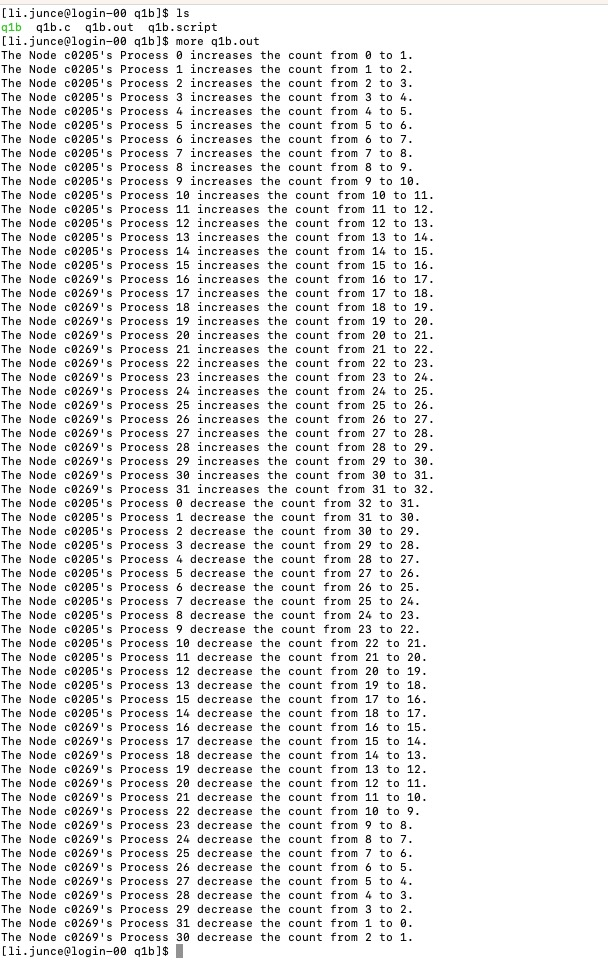
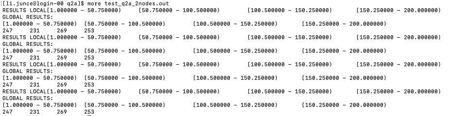

 EECE5640 Homework 4 

# Question 1

## a.)

Please see the details in the code part -> q1/q1a/q1a.c

The result is as follow:

## b.)

Please see the details in the code part -> q1/q1b/q1b.c

The result is as follow:

# Question 2

## a.)

Files "q2a.c" contain the programming used in this question. The scripts "q2a 2nodes.script" and "q2a 4nodes.script" have been used in turn to execute the script with the two different node configurations, 2 and 4, respectively. If we print all of results, it will cost lots of time. Thus, initial results have been obtained from histogramming 1,000 integers between 0 and 200 in 4 bins (using 2 nodes and 2 tasks per node, using q2aTest.c, using the bash script in "q2aTest.script") to verify that the code is operating as intended. And the result is as follow:

Calculation time for 100 processes and 100 bins in the histogram of 2e6 numbers between 1 and 1e6

|2Nodes| RunnigTime(s) | 
| :---:|   :----:      | 
| 1    |  1.548445     | 
| 2    | 1.448345       | 
| 3    | 1.543441       | 
| 4    | 1.528245       | 
| 5    | 1.528349       | 
| 6    | 1.445448       | 
| 7    | 1.528642       | 
| 8    | 1.482447       |

| 4Nodes| RunnigTime(s) | 
| :---:|   :----:       | 
| 1    | 0.717249       | 
| 2    | 0.707238       | 
| 3    | 0.725145       | 
| 4    | 0.713249       | 
| 5    | 0.707248       | 
| 6    | 0.717243       | 
| 7    | 0.704248       | 
| 8    | 0.718845       |

A total of 8 experiments, with 2 or 4 nodes in each configuration, have been carried out to assess the code's performance. The below table presents the findings. We see that, on average, the code speeds up by 53.6% in the 4 node configuration compared to the 2 node configuration. This may be due to the fact that communication between nodes is not the bottleneck but rather the computation of the histogram; as a result, using more nodes still results in a faster overall performance.

## b.)

The code in "q2a/q2a.c" has been slightly updated for this area of the assignment and saved in a new file called "q2b/q2b.c." Only 20 bins are used to construct the histogram with this version of the code. When there are more processes than bins, control sequences are also included (for example, when there are 4 nodes, there are 3 minimum tasks per node, thus there are 12 processes). If not managed properly, two of these processes—which in this case are idle while the other processes compute the histogram—could cause the application to crash. We don't need to test this code like q2aTest.c because it works fine and is identical to q2a/q2a.c.

Using the files "q2b 2nodes.script" and "q2b 4nodes.script," the identical eight run test has been conducted for each setup. The results are listed below. 

Calculation time for 20 processes and 20 bins in the histogram of 2e6 numbers between 1 and 1e6

|2Nodes| RunnigTime(s) | 
| :---:|   :----:      | 
| 1    | 0.162674       | 
| 2    | 0.159673       | 
| 3    | 0.161649       | 
| 4    | 0.161824       | 
| 5    | 0.159124       | 
| 6    | 0.158674       | 
| 7    | 0.162621       | 
| 8    | 0.161614       |

| 4Nodes| RunnigTime(s) | 
| :---:|   :----:       | 
| 1    | 0.217819       | 
| 2    | 0.227418       | 
| 3    | 0.197919       | 
| 4    | 0.209818       | 
| 5    | 0.219817       | 
| 6    | 0.216119       | 
| 7    | 0.220869       | 
| 8    | 0.216817       |

This time, we see that the performance for both configurations is similar, and in the case of 4 nodes, the performance is significantly lower. In this case, finding a bin only requires each process to iterate through a maximum of 20 bins for each of the 2 million variables. This indicates that each process is under substantially less computational stress and that the communications between nodes are currently the bottleneck. An average 25.3% difference in computing time for the 4-node case reflects this constraint.

## c.)

As stated, because there are more processes in part a than in part b, each process in part a must discover the bin for a lesser number of numbers. Finding the bin of each integer, however, requires checking no more than 100 bins, which increases the computing workload compared to the 20 bin situation. Because of this, we can see in section a) that the actual binning at each process is the bottleneck, and additional nodes lead to noticeably higher performance. On the other hand, since the computational load is significantly lower for 20 bins, the bottleneck in part b) is caused by communication between nodes. This leads to improved performance when there are only two nodes.

# Question 3

Please see the details of codes in q3/matmulCUDA.cu

The results have been displayed as a table plot.

Using p100 gpu:

| Threads| GPU RunnigTime(ms) | CPU RunnigTime(ms)|
| :---:|   :----:       | :----:       |
| 32   | 5.342560       |  4506.275391      |
| 64    | 0.009152       |  4479.407227       |
| 96    | 0.008544       |  4394.415039       |
| 128    | 0.008256       |  4381.976562       |
| 160   | 0.009248       |  4380.418457       |

For p100 gpu: 

When I reached 128 threads, like in the experiments I conducted with constant input data size, I found that the performance improvement was not particularly obvious. As a result, I can state that my algorithm's strong scalability reaches its maximum at about 128 threads.

Using k80 gpu:

| Threads| GPU RunnigTime(ms) | CPU RunnigTime(ms)|
| :---:|   :----:       | :----:       |
| 32   | 21.963680       |  4185.623535       |
| 64    | 0.013248       |  4194.656738       |
| 96    | 0.012576       |  4193.613281      |
| 128    | 0.013184       |  4193.234375       |
| 160   | 0.012768       |  4190.564941       |

For k80 gpu: 

Similar to my trials with fixed input data size, I found that the performance boost was not particularly noticeable when I reached 96 threads. I can therefore say that the strong scalability of my method reaches its limit at roughly 96 threads.

Overall, p100 performs more effectively than k80.

# Question 4

The "MPI on Millions of Cores" study primarily discussed three parts of the scalability problem, namely the MPI scalability problem, how to increase scalability, and the parallel algorithms used to scale to millions of cores. Large-scale MPI problems exist in 2010, particularly with regard to memory usage.At that time, two concentrations to improve scalability were memory utilization and the effectiveness of all collective functions. The program's fundamental algorithms are the sole way to enable application scalability.

According to the document "A survey of MPI usage in the US exascale computing project" which was first published in 2018, the three primary areas on which exascale computing at the time concentrated were application development, software technology, and hardware technology [1].

According to another research, a novel parallel programming approach that supports massively parallel performance is proposed [2]. It uses coarse- and fine-grained parallelism over inter- and intra-node.

References:
[1] Bernholdt, D. E., Boehm, S., Bosilca, G., Gorentla Venkata, M., Grant, R. E., Naughton, T., ... & Vallee, G. R. (2020). A survey of MPI usage in the US exascale computing project. Concurrency and Computation: Practice and Experience, 32(3), e4851.
[2] Ashraf, M. U., Eassa, F. A., Albeshri, A. A., & Algarni, A. (2018). Toward exascale computing systems: An energy efficient massive parallel computational model. International Journal of Advanced Computer Science and Applications, 9(2).
