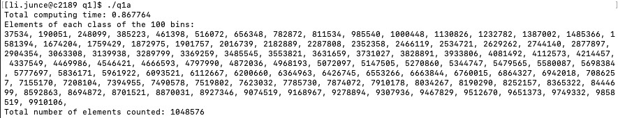

 EECE5640 Homework 5 

# Question 1

## a.)

Please see the details in the code part -> q1/q1a.cu

The file "q1a.cu" contains the code for this assignment section. The CUDA version used is 10.2, and the gcc version used is 6.4.0. The code's results when N is changed from 2^10 to 2^25 are shown in the section below.

### Table: Performance of the histogramming kernel in CUDA

|N| RunnigTime(s) | 
| :---:|   :----:      | 
| 2^10    |  0.736432     | 
| 2^15    | 0.785164       | 
| 2^20    | 0.867764       | 
| 2^25     | 1.530185       | 

The runtime grows as the input does, with a 107.7% increase in computational time between N = 2^10 and 2^25. 

## b.)

Please see the details in the code part -> q1/q1b.c

The file "q1b.c" contains the code that was used to test the histogramming issue with OpenMP. The outputs from this implementation, which used the same inputs as the previous section from N = 2^10 to 2^25, are shown below. 

### Table: Performance of the histogramming kernel in OpenMP

|N| RunnigTime(s) | 
| :---:|   :----:      | 
| 2^10    |  1.343144     | 
| 2^15    | 1.732407       | 
| 2^20    | 5.842574       | 
| 2^25     | 25.615100       | 

One the one hand, the CPU and GPU no longer communicate with one another, which results in significantly lower absolute computing time values, CPU running time is more than GPU at the same condition. On the other hand, I notice CPU poor scalability in comparison to the GPU version increase between N=2^10 and 2^25, clearly demonstrating the scalability advantage of using GPUs.

# Question 2

## a.)

Please see the details in the code part -> q2/q2a.cu

The file "q2a.cu" contains the code used for this section of the assignment. Once more, the versions of CUDA and gcc used are 6.4.0 and 10.2, respectively. 

The 6-element 3D stencil computation has been converted to a GPU implementation using the method of assigning one read of "b" and the corresponding constant multiplication and addition in "a" to each thread.

Nthreads = (n-2)^3 * 6 represents the total number of threads as being equal to the sum of the non-zero elements of "a" ((n-2)^3) and the number of reads of "b" per element of "a." We set the initial values of all the elements in "b" to 1, performed the stencil computation for low values of n (4), and printed the results to verify the code's output. All non-boundary elements of "a" should be equal to 4.8 (6*0.8) and 0 for the boundary values in the output for the code given above. The code output for the case of n=4 is shown in below, where each 4 by 4 matrix represents a different value of the k-index. The correct behavior of the code is then verified from there.

Below are the computation time results for various "n" values. Here, we can see how well the GPU scales, with almost no change in computation time from n=4 to n=512. Beyond those points, there are more threads than the GPU can handle, and some operations are serialized, which lengthens the computation time.

### Table: Computing time performance for the proposed GPU implementation of the 6-element 3D stencil computaion

|N| ComputingTime(s) | 
| :---:|   :----:      | 
| 4    |  0.713142     | 
| 8    |    0.770687    | 
| 16    |   0.786224     | 
| 32     |  0.845023      |
| 64     | 0.834579      | 
| 128     |  0.834081      | 
| 256     | 0.996141     |  
| 512     | 1.753866        |

## b.)

We can use tensorflow to accelerate my code on the GPU. TensorFlow supports running computations on a variety of types of devices, including CPU and GPU. They are represented with string identifiers for example:
- "/device:CPU:0": The CPU of your machine.
- "/GPU:0": Short-hand notation for the first GPU of your machine that is visible to TensorFlow.
- "/job:localhost/replica:0/task:0/device:GPU:1": Fully qualified name of the second GPU of your machine that is visible to TensorFlow.

If a TensorFlow operation has both CPU and GPU implementations, by default, the GPU device is prioritized when the operation is assigned. For example, tf.matmul has both CPU and GPU kernels and on a system with devices CPU:0 and GPU:0, the GPU:0 device is selected to run tf.matmul unless you explicitly request to run it on another device.

If a TensorFlow operation has no corresponding GPU implementation, then the operation falls back to the CPU device. For example, since tf.cast only has a CPU kernel, on a system with devices CPU:0 and GPU:0, the CPU:0 device is selected to run tf.cast, even if requested to run on the GPU:0 device.

# Question 3

The'most advanced data center accelerator' architecture was unveiled in 2016 as the Pascal P100 architecture by NVIDIA. As already mentioned, this architecture was designed to enhance the efficiency of the computing equipment in data centers.

On the other hand, the Ampere A100 architecture, which was just unveiled (in May 2020), is NVIDIA's first 7nm architecture geared toward computations related to AI and neural networks. The A100 architecture uses third-generation Tensor Cores, which are processing units that speed up matrix multiplication, one of the most frequent operations in the field of AI and Deep Learning, among other advancements.

The technical features of NVIDIA's most recent architectures, the Pascal, Volta, and Ampere architectures, are summarized in Table: Specifications of the three most recent architectures from NVIDIA.

In addition to having tensor cores, which the P100 architecture lacks, we note that the Ampere architecture offers higher specifications in almost every category. It is important to note that the Ampere architecture has fewer tensor cores per GPU, which could give the impression that it performs worse. The A100 architecture's main differentiating feature, the use of fine-grained structured sparsity, allows it to achieve 20x the overall mixed-precision compute capabilities compared to P100. The main secret of the A100 performance improvements is the use of sparse matrix representations, which can significantly increase the throughput of general matrix multiplication as was studied in earlier homework assignments.

### Table: Specifications of the three most recent architectures from NVIDIA

|DATA CENTER GPU| NVIDIA TESLA P100 | NVIDIA TESLA V100| NVIDIA A100 |
|     :---:     |       :----:      |      :----:      | :----:      | 
| GPU Codename  |  GP100            | GV100            |GA100     |
| GPU Architecture    |    NVIDIA Pascal    | NVIDIA Volta    |NVIDIA Ampere    |
| GPU Board Form Factor    |   SXM     | SXM2     | SXM4     |
| SMs     |  56      | 80      | 108      |
| TPCs     | 28      | 40      | 54      |
| FP32 Cores/SM     |  64      |  64      | 64      | 
| GPU Boost Clock     | 1480 MHz     |  1530 MHz     | 1410 MHz     |

References:

https://www.hardwaretimes.com/nvidia-ampere-architectural-analysis-a-look-at-the-a100-tensor-core-gpu/

https://technical.city/en/video/Tesla-P100-PCIe-16-GB-vs-Tesla-A100 

https://en.wikipedia.org/wiki/Ampere_(microarchitecture) 

# Question 4

Please see the details in the code part -> q4/

## Testing in P100 node

### Table: Performance of computing vector addition in P100

| Method    | RunnigTime(msec) | 
| :---:|   :----:      | 
| CUDA    |  0.029408     | 
| OpenACC    | 0.785164       | 

## Testing in A100 node

### Table: Performance of computing vector addition in A100

| Method    | RunnigTime(msec) | 
| :---:|   :----:      | 
| CUDA    |  0.025152    | 
| OpenACC    | 2.754387       | 

The performance of employing CUDA is more effective in two separate nodes, despite the fact that OpenACC can speed up the run speed.

# Question 5

Please see the details in the code part -> q5/

For the single precision, the files "q5_single.cu" contain the code used for this section of the assignment. Once more, the versions of CUDA and GCC used are 6.4.0 and 10.2, respectively. 11 different iteration values have been tested and measured for both versions (N = 2^10, 2^11,..., 2^20). Below presents the findings. From the result table, we can once more see how the GPU's scalability properties produce constant compute times for a range of input iteration values that rise exponentially in number.

### Performance of the single precision Leibniz’s series Pi computation using a GPU

|N| ComputingTime(s) | Pi |
| :---:|   :----:      | :----:      |
| 2^10    |  0.730869     | 3.1406140327453613     |
| 2^11    |    0.826870    | 3.1411006450653076     |
| 2^12    |   0.718903     | 3.1413505077362061     |
| 2^13     |  0.733090      |3.1414725780487061     |
| 2^14     | 0.720390      | 3.1415269374847412     |
| 2^15     |  0.790834      | 3.1415696144104004     |
| 2^16     | 0.771916     |  3.1415817737579346     |
| 2^17     | 0.760510        |3.1415886878967285     |
| 2^18     | 0.925196        |3.1415917873382568     |
| 2^19     | 0.732396        |3.1415936946868896     |
| 2^20     | 0.729117        |3.1415960788726807     |

The results for double precision have not been included because the proposed code uses Cuda's "atomicAdd" function, which is incompatible for the GPU in question with double precision input variables. The suggested double atomic implementation has been attempted, but it has also failed.